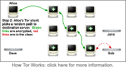

Most likely you are accessing this page because you had some issue with
the traffic originating from **\*.tor.shh.sh**. These routers are part of the
[Tor Anonymity Network](https://www.torproject.org/), which is
dedicated to [providing privacy](https://www.torproject.org/about/overview) to
people who need it most: average computer users. The
router IPs should be generating no other traffic, unless it has been
compromised.

### Currently maintained Tor Relays

1. [as16276.tor.shh.sh](https://metrics.torproject.org/rs.html#details/39F096961ED2576975C866D450373A9913AFDC92) - 198.50.191.95 (non-exit, fallback directory)

### What is Tor?

1. [Tor Overview](https://www.torproject.org/about/overview)
1. [Tor Abuse FAQ](https://www.torproject.org/docs/faq-abuse)
1. [Tor Legal FAQ](https://www.torproject.org/eff/tor-legal-faq)

Tor sees use by
[many important segments of the population](https://www.torproject.org/about/torusers),
including whistle blowers,
journalists, Chinese dissidents skirting the Great Firewall and oppressive
censorship, abuse victims, stalker targets, the US military, and law
enforcement, just to name a few.  While Tor is not designed for malicious
computer users, it is true that they can use the network for malicious ends.
In reality however, the actual amount of
[abuse](https://www.torproject.org/docs/faq-abuse) is quite low. This
is largely because criminals and hackers have significantly better access to
privacy and anonymity than do the regular users whom they prey upon. Criminals
can and do
[build, sell, and trade](http://voices.washingtonpost.com/securityfix/2008/08/web_fraud_20_tools.html)
far larger and
[more powerful networks](http://voices.washingtonpost.com/securityfix/2008/08/web_fraud_20_distributing_your.html)
than Tor on a daily basis. Thus, in the mind of this
operator, the social need for easily accessible censorship-resistant private,
anonymous communication trumps the risk of unskilled bad actors, who are
almost always more easily uncovered by traditional police work than by
extensive monitoring and surveillance anyway.

In terms of applicable law, the best way to understand Tor is to consider it a
network of routers operating as common carriers, much like the Internet
backbone. However, unlike the Internet backbone routers, Tor routers
explicitly do not contain identifiable routing information about the source of
a packet, and no single Tor node can determine both the origin and destination
of a given transmission.

As such, there is little the operator of this router can do to help you track
the connection further. This router maintains no logs of any of the Tor
traffic, so there is little that can be done to trace either legitimate or
illegitimate traffic (or to filter one from the other).  Attempts to
seize this router will accomplish nothing.

### Email/DMCA concerns

Furthermore, our US nodes may serve as a carrier of email, which means that
its contents are further protected under the ECPA.
[18 USC 2707](http://www.law.cornell.edu/uscode/text/18/2707)
explicitly allows for civil remedies ($1000/account **plus** legal fees)
in the event of a seizure executed without good faith or probable cause (it
should be clear at this point that traffic from those hosts should not
constitute probable cause to seize the
machine). Similar considerations exist for 1st amendment content on those hosts.

If you are a representative of a company who feels that this router is being
used to violate the DMCA, please be aware that our nodes do not host or
contain any illegal content. Also be aware that network infrastructure
maintainers are not liable for the type of content that passes over their
equipment, in accordance with
[DMCA "safe harbor" provisions](http://www.law.cornell.edu/uscode/text/17/512).
In other words, you will have just as much luck
sending a takedown notice to the Internet backbone providers. Please consult
[EFF's prepared response](https://www.torproject.org/eff/tor-dmca-response)
for more information on this matter.

### Submitting Complaints or Other Remedies

That being said, if you still have a complaint about the router,  you may
email [postmaster \[at\] shh \[dot\] sh](mailto:postmaster@shh.sh). If
complaints are related to a particular service that is being abused, I will
consider removing that service from my exit policy, which would prevent my
router from allowing that traffic to exit through it. I can only do this on an
IP+destination port basis, however. **Common P2P and SMTP ports are
already blocked.**

You also have the option of blocking the IP addresses of these nodes and others on
the Tor network if you so desire. The Tor project provides a
[web service](https://check.torproject.org/cgi-bin/TorBulkExitList.py)
to fetch a list of all IP addresses of Tor exit nodes that allow exiting to a
specified IP:port combination, and an official
[DNSRBL](https://www.torproject.org/tordnsel/dist/) is also available to
determine if a given IP address is actually a Tor exit server. Please
be considerate
when using these options. It would be unfortunate to deny all Tor users access
to your site indefinitely simply because of a few bad apples.
